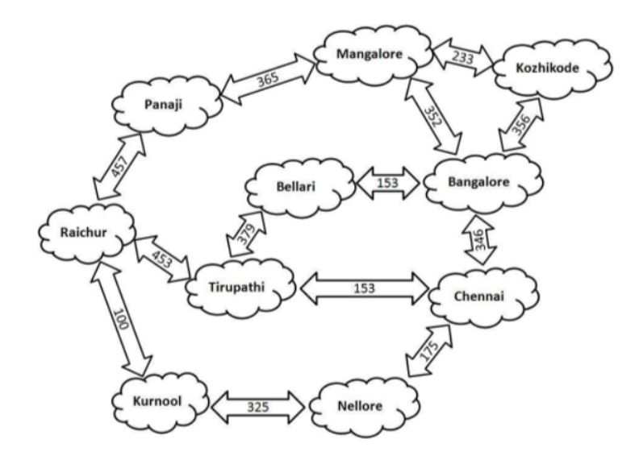

# GPS Search Agent: Finding the Optimal Path

An implementation of **Local Search (Genetic Algorithm)** to solve a pathfinding problem between Panaji and Chennai.

## 📍 Problem Statement
The goal of this agent is to find the most optimal road path covering various cities in the given map while minimizing the total distance travelled between any two points.



---

## 🏗️ Project Components

The project is structured modularly to separate data handling, the genetic engine, and the search models. Implementing the Genetic Algorithm in a single function would have led to messy code; therefore, it is organized as follows:

- **`src/utils.py`**: Contains the `haversine` formula and `DataUtils` for cleaning geographical data.
- **`src/models.py`**: Defines the `Chromosome` and `FitnessFunction` classes.
- **`src/ga_engine.py`**: The core Genetic Algorithm logic (Selection, Crossover, Mutation).
- **`main.py`**: The entry point to run the simulation and find the best path.

---

## 🧬 Genetic Algorithm Implementation

### 1. Chromosome Structure
The **chromosome** is designed as an array of integers where each integer represents a unique city (node).
* **Representation**: A sequence in the array depicts the path taken by the agent. For example, `[1, 5, 3]` represents a transition from City 1 to City 5 to City 3.
* **Logic**: Handled by the `Chromosome` class, which manages mapping between city names and integers using the `map_df`.
* **Methods**: 
    - `path_to_chromosome`: Converts a pandas DataFrame of edges into an integer array.
    - `chromosome_to_path`: Reconstructs the DataFrame from the integer array for evaluation.


### 2. Fitness Function
The fitness function evaluates the quality of an explored path. It is designed to return large values for valid paths that reach the goal and very small values ($0$ to $1$) for invalid paths.

#### Mathematical Formulation
Let:
- $g(n)$ be the path cost.
- $h(n)$ be the heuristic cost (Haversine distance from the last node to the goal).
- $\text{penalty}$ be the penalty for an invalid path (loops or disconnected edges).
- $\text{reward}$ be the reward for reaching the goal state.

**Step 1: Calculate the Score**

$$\text{score} = \text{reward} - (g(n) + h(n) + \text{penalty})$$

**Step 2: Calculate Fitness Value**

To facilitate **Roulette Wheel Selection**, all fitness scores must be positive. We map negative scores to a small value between $(0, 1]$ to ensure they have a minimal chance of selection:

$$
\text{fitness} = \begin{cases} \frac{1}{|\text{score}|}, & \text{if score} < 0 \\ \text{score}, & \text{otherwise} \end{cases}
$$

### 3. Algorithm Stages
- **Population Initialization**: We select the starting point, then randomly select neighbors of the previous point until a randomly selected chromosome size is reached.
- **Crossover (Edge Recombination)**: Specifically used for shortest path problems, this strategy builds offspring by preserving as many node-connections as possible from parents, prioritizing neighbors with the fewest active connections.
- **Mutation (Scramble)**: A subset of the path is shuffled randomly. While this explores new paths, it may lead to invalid paths which are subsequently filtered by the fitness penalty.
- **Selection**: 
    - **Crossover Selection**: Uses Roulette Wheel selection to pick two parents from the current generation.
    - **Next Generation Selection**: Combines both parents and children and leverages Roulette Wheel selection to ensure the fittest individuals survive (Elitism).


---

## 🚀 Getting Started

This project uses [**uv**](https://docs.astral.sh/uv/) for fast Python package management.

### 1. Prerequisites
You need to have `uv` installed. 
> **Note:** Follow the guide on the [Official uv Website](https://docs.astral.sh/uv/getting-started/installation/) to set it up locally.

### 2. Environment Setup
```bash
# Sync environment and install dependencies (Pandas, Numpy, etc.)
uv sync